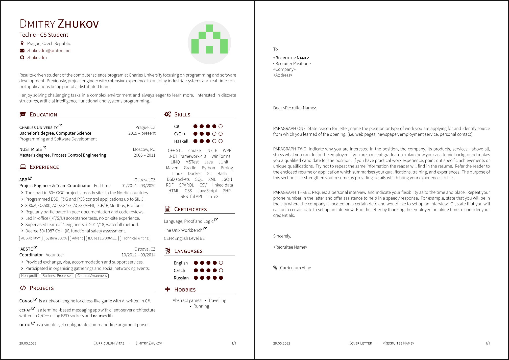

# cv

The `cv` includes one-page resume and cover letter with unified document style.

# Prerequisites

[TeX Live](https://www.tug.org/texlive/) is assumed to be installed
on the target system.

# Build

To compile both documents, execute `make`. Run `make resume` or `make cover-letter`
for separate compilation. Files are generated in `./out` folder.

# How to use

You are free to copy and modify source codes. Please, **do not** use my personal
information in any malicious or unsolicited way.

# Credits

`cv` is built on top of the following projects:

- [posquit0/Awesome-CV](https://github.com/posquit0/Awesome-CV),
- [rpi.edu/latex/resumes](https://www.rpi.edu/dept/arc/training/latex/resumes/),
- [darwiin/yaac-another-awesome-cv](https://github.com/darwiin/yaac-another-awesome-cv),
- fonts from [adobe-fonts/source-sans](https://github.com/adobe-fonts/source-sans).

# Preview

